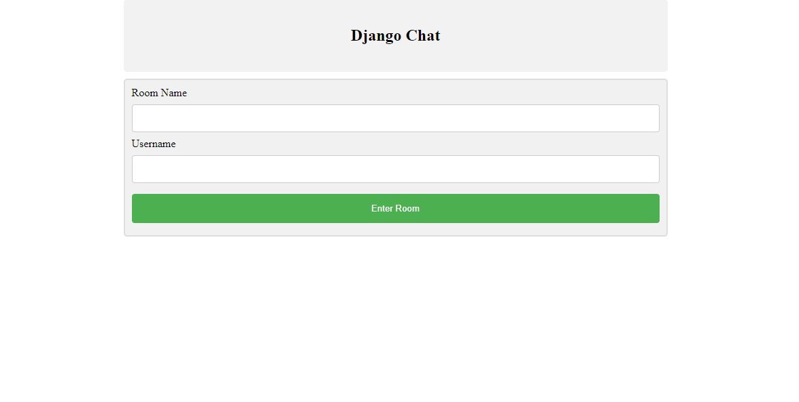

## Django Real Time Chat

This projects implements a real time chat webpage using Django.

The architecture of the project uses a slightly varied version of
the MVC frame work (Model-View-Controller).


## Where to start

Open the files in vscode or any other environment and within the terminal run the server.
Using this inside the terminal:

```bash
python manage.py runserver
```

Once inside the webpage we can enter a room name to create a new room and a new username.



Once inside we can start typing in real time!

## Architecture

As the user sends requests to the database, the requests are first met by the
controller, and the controller interprets what to do with the request. It is
responsible for handling the flow of requests and does not handle any logic.

## Controller

The [views.py](chat/views.py) file in this project acts as the controller and it handles the
flow of traffic of requests.

```python
from django.shortcuts import render, redirect
from chat.models import Room, Message
from django.http import HttpResponse, JsonResponse

def home(request):
    return render(request, 'home.html')

def room(request, room):
    username = request.GET.get('username')
    room_details = Room.objects.get(name=room)
    return render(request, 'room.html', {
        'username': username,
        'room': room,
        'room_details': room_details
    })
```

With each request, the controller determines whether the request needs to fetch
data or fetch any presentation. In the case of this project, the controller uses
certain functions to determine what to display in on the HTML page.

## Model

The model is responsible for interacting with the database and handles all the
classes of data. In the project we have two classes: Room and Message.

The Room class holds all the names of the rooms created on the webpage and the Message class
contains the all the Messages contained in each room with each message containing:

- **Value**: the message sent
- **Date**: date the message was created
- **User**: user the message was created by
- **Room**: the room the message was created inside

## View

The view as shown in the image above, it handles all the presentation. In Django it
is called templates. We have a folder filled with HTML files that are used based on a
certain request given from the controller.

The home page is given below where we enter the room name and the username.

On the home page, we are given the two inputs, room name and username. Once a room name
is entered. The HTML file communicated with the controller to check the model ensure that
that name has never been created before, if it has we use that same room.

As mentioned the HTML file [home.html](templates/home.html) is contacts the controller:

```HTML
      <form id="post-form" method="POST" action="checkview">
        
        <label>Room Name</label>
        <input type="text" name="room_name" id="room_name" width="100px" />
        <label>Username</label>
        <input type="text" name="username" id="username" width="100px" />
        <input type="submit" value="Enter Room" />
      </form>
```

Then the controller communicates with the model:

```python
def checkview(request):
    room = request.POST['room_name']
    username = request.POST['username']

    if Room.objects.filter(name=room).exists():
        return redirect('/'+room+'/?username='+username)
    else:
        new_room = Room.objects.create(name=room)
        new_room.save()
        return redirect('/'+room+'/?username='+username)
```

Finally the the controller sends the user to the appropriate room where they
can start chatting with who ever else is within the same chat room.

>

## Ajax

We use ajax to ensure a 0.5sec interval function, that provides any new chats that may
appear while anyone is inside the chat

Found inside the [room.html](templates/room.html)

```javascript
    <script>
      $(document).ready(function () {
        setInterval(function () {
          $.ajax({
            type: "GET",
            url: "/getMessages/{{room}}/",
            success: function (response) {
              console.log(response);
              $("#display").empty();
              for (var key in response.messages) {
                var temp =
                  "<div class='container darker'><b>" +
                  response.messages[key].user +
                  "</b><p>" +
                  response.messages[key].value +
                  "</p><span class='time-left'>" +
                  response.messages[key].date +
                  "</span></div>";
                $("#display").append(temp);
              }
            },
            error: function (response) {
              alert("An error occured");
            },
          });
        }, 500);
      });
    </script>
```
